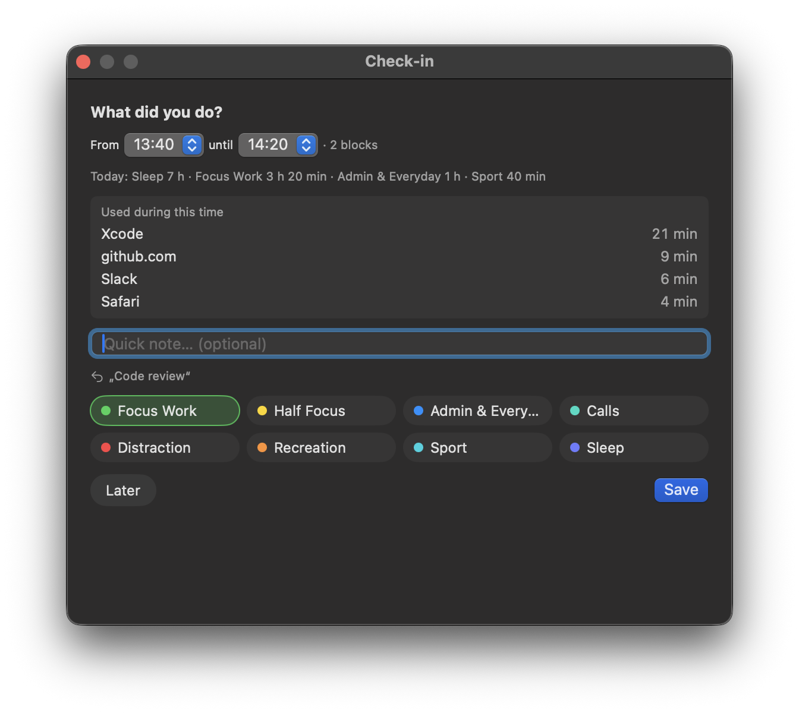
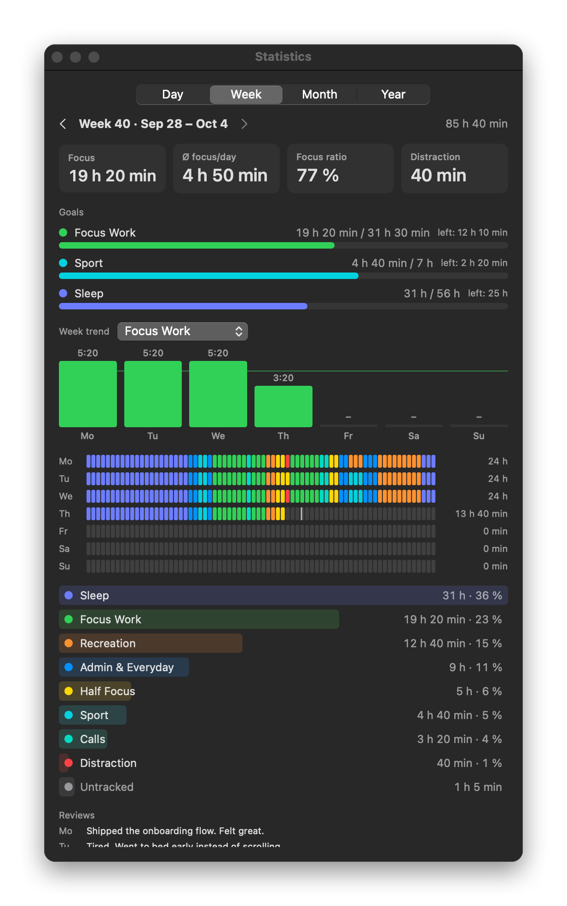
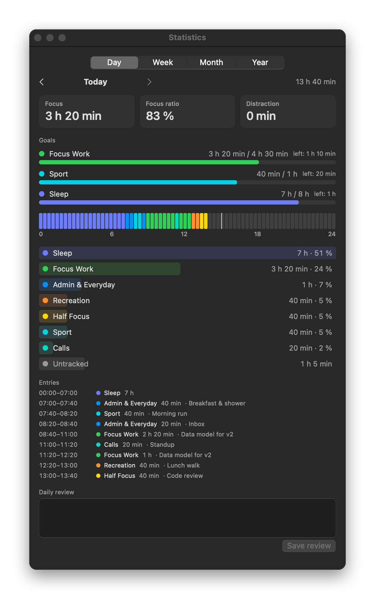
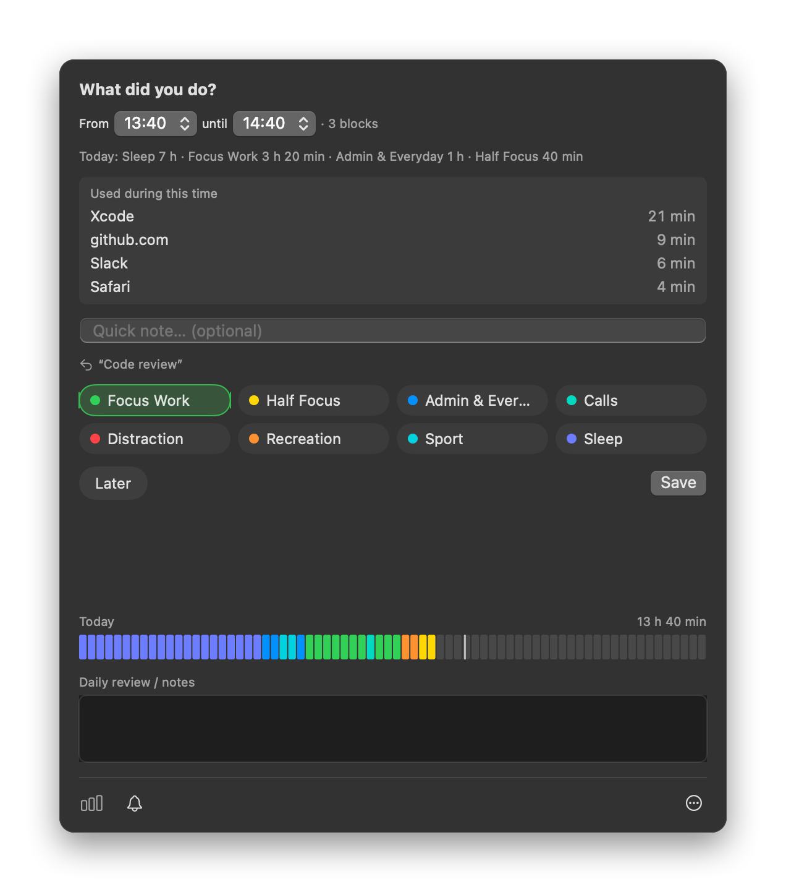
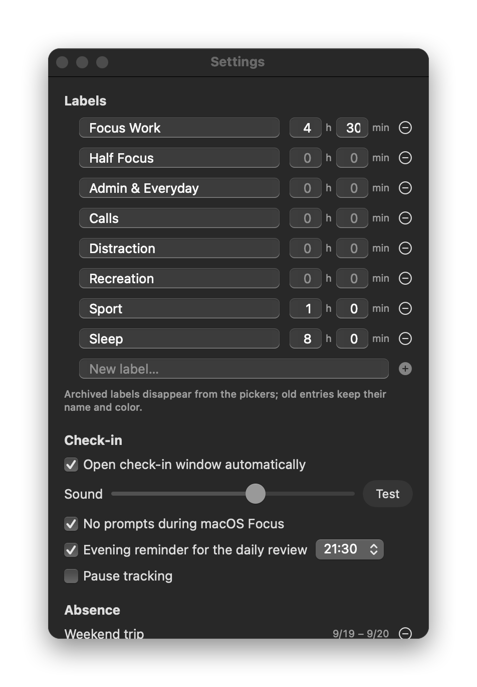
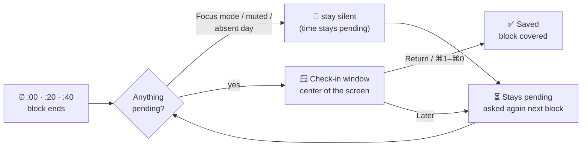

<div align="center">


# 20minTrack

**Know where your day actually went — in 20-minute blocks.**

A tiny macOS menu bar app that asks *"What did you do?"* every 20 minutes.
One keystroke to answer, nothing ever slips through the cracks, and honest statistics at the end of the week.

[](#install)
[](#install)
[](Package.swift)
[](LICENSE)

[**Install**](#install) · [Features](#features) · [How it works](#how-it-works) · [Privacy](#privacy) · [Contributing](#contributing) · [Deutsch](README.de.md)

<br>



</div>

---

## Why

Timers measure what you *planned*. 20minTrack records what you *did*.

Every 20 minutes, on the clock (:00, :20, :40), a small window pops up in the middle of your screen. You pick a label — *Focus Work*, *Calls*, *Distraction*, … — optionally type a few words, and press <kbd>Return</kbd>. That's it. Two seconds, then back to work.

The result is a complete, block-by-block picture of your day: how much real focus you got, where the afternoon disappeared, and whether you're hitting the goals you set yourself.

## Features

<table>
<tr>
<td width="50%" valign="top">

### ⚡️ One-keystroke check-ins
Your last label is preselected — <kbd>Return</kbd> saves. <kbd>⌘1</kbd>–<kbd>⌘9</kbd> (and <kbd>⌘0</kbd>) pick a label and save instantly. Pick **two** labels and the block is split 10/10.

### 🧩 No gaps, ever
Mac asleep? In a meeting? Missed blocks collapse into **one pending range** that's asked about next time. Split it with *From / until*, fill it piece by piece — the window stays until everything is covered. *Later* postpones, but never drops time.

### 🧠 A memory aid built in
"Used during this time: Xcode 21 min · github.com 9 min" — the apps (and browser sites) you used in the block are listed right in the check-in, so you never have to guess.

</td>
<td width="50%" valign="top">

### 📊 Statistics that tell the truth
Day, week, month and year views with focus time, focus ratio, distraction, per-label bars and clickable day strips to edit the past. Settled days count untracked time as distraction — no hiding.

### 🎯 Daily goals
Set a goal per label (*4 h 30 min focus*, *8 h sleep*) and watch progress bars fill up — per day, and scaled to the week.

### 🌙 Daily review
An evening reminder for a short *Fazit* of the day. Missed it? You're asked once more the next morning.

### 🔕 Respectful
Silent during macOS Focus modes, timed mute for calls (20 min / 1 h / 2 h / until tomorrow), planned absences for vacations — no prompts, no fake "distraction".

</td>
</tr>
</table>

<table>
<tr>
<td width="50%"></td>
<td width="50%"></td>
</tr>
<tr>
<td align="center"><sub><b>Week</b> — goals, trend per label, every block of every day</sub></td>
<td align="center"><sub><b>Day</b> — totals, goals, timeline and merged entries</sub></td>
</tr>
<tr>
<td width="50%"></td>
<td width="50%"></td>
</tr>
<tr>
<td align="center"><sub><b>Menu bar popover</b> — check-in, today's strip, live notes</sub></td>
<td align="center"><sub><b>Settings</b> — your own labels, colors and daily goals</sub></td>
</tr>
</table>

## Install

**Requirements:** macOS 13 Ventura or newer · Apple Silicon or Intel

### Option 1 — one line in Terminal (recommended)

```bash
curl -fsSL https://raw.githubusercontent.com/moritzthln/20minTrack/main/install.sh | bash
```

Downloads the latest release, installs it to `/Applications`, and starts it. A small circle with a countdown appears in your menu bar.

### Option 2 — manual download

1. Download **`20minTrack.zip`** from the [latest release](https://github.com/moritzthln/20minTrack/releases/latest).
2. Unzip it and drag **20minTrack.app** into your *Applications* folder.
3. The app isn't notarized by Apple, so macOS blocks the first launch. Run this once in Terminal:
   ```bash
   xattr -cr /Applications/20minTrack.app
   ```
4. Open the app.

> **Tip:** Click the menu bar circle → **⋯** → **Settings** → enable **Launch at login**.

### Option 3 — build from source

```bash
git clone https://github.com/moritzthln/20minTrack.git
cd 20minTrack
./build.sh        # universal release build, installed to /Applications
```

Needs the Xcode Command Line Tools (`xcode-select --install`).

## How it works



- **The day is a grid** of wall-clock-aligned 20-minute blocks — 72 per day.
- **Nothing is dropped.** Unanswered blocks stay pending and merge into one range. Lookback reaches back to the start of yesterday, so a forgotten evening can always be filled in the next morning.
- **Editing is easy.** Click any block in a day strip (popover or statistics) to edit it; click an empty one and the editor opens over the whole surrounding gap — drag across a strip to select a range.
- **Older days settle.** Anything still untracked from the day before yesterday counts as *Distraction* in the statistics ("deliberately untracked"). Days without a single entry and planned absences never do.

### Keyboard shortcuts (check-in)

| Key | Action |
|---|---|
| <kbd>Return</kbd> | Save with the selected label(s) |
| <kbd>⌘1</kbd> … <kbd>⌘9</kbd>, <kbd>⌘0</kbd> | Pick label 1–10 and save immediately |
| <kbd>Esc</kbd> | Later — keep the range pending |
| Click a selected label | Deselect it (never saves) |

Labels, colors and goals are fully customizable in Settings. The app speaks **English and German** (follows the system language, switchable in Settings).

## Privacy

Everything stays on your Mac. No account, no cloud, no analytics, no network requests.

| What | Where |
|---|---|
| Entries and daily reviews | `~/Library/Application Support/20minTrack/days/YYYY-MM-DD.json` |
| App usage (memory aid) | `~/Library/Application Support/20minTrack/usage/YYYY-MM-DD.json` |
| Settings | `~/Library/Preferences/com.moritzthelen.twentymintrack.plist` |

The usage list records which app is frontmost. For Safari, Chrome and Arc it can also show the website domain — macOS asks once per browser for permission, and you can simply decline. The data files are plain JSON, so they're easy to back up, sync yourself, or analyze.

<details>
<summary><b>Uninstall</b></summary>

Quit the app (menu bar circle → right-click → Quit), then:

```bash
rm -rf /Applications/20minTrack.app
rm -rf ~/Library/Application\ Support/20minTrack      # your data — optional
defaults delete com.moritzthelen.twentymintrack        # settings — optional
```
</details>

## FAQ

<details>
<summary><b>"20minTrack can't be opened because Apple cannot check it for malicious software."</b></summary>

The app is ad-hoc signed but not notarized (that needs a paid Apple developer account). Run `xattr -cr /Applications/20minTrack.app` once — the installer script does this for you. Alternatively: *System Settings → Privacy & Security → Open Anyway*.
</details>

<details>
<summary><b>Why does ⌘Q not quit the app?</b></summary>

On purpose: a reflexive ⌘Q would silently stop tracking. Quit via right-click on the menu bar circle → *Quit 20minTrack*.
</details>

<details>
<summary><b>I don't see the menu bar icon.</b></summary>

On MacBooks with a notch, a full menu bar can hide icons behind it. Remove a few other menu bar items, or use a menu bar manager.
</details>

<details>
<summary><b>Can I use it with my own categories?</b></summary>

Yes. Rename, recolor, archive or add labels in Settings. Archived labels disappear from the check-in but old entries keep their name and color.
</details>

## Development

Native Swift + SwiftUI in an AppKit shell (`NSStatusItem`, `NSPopover`, `NSWindow`), Swift Package Manager only — no Xcode project.

```bash
./test.sh       # test suite (custom runner, no XCTest needed)
./build.sh      # universal build + install to /Applications
./package.sh    # shareable dist/20minTrack.zip
```

| Path | Contents |
|---|---|
| `Sources/TwentyCore/` | All logic, fully tested: slot grid math, pending ranges, gap filling, attribution, absences, statistics |
| `Sources/TwentyTrackApp/` | The app: status item, windows, SwiftUI views |
| `Tests/TwentyTrackTestRunner/` | Test suites |

Both scripts pin the Command Line Tools toolchain on purpose — see [`CLAUDE.md`](CLAUDE.md) for architecture notes and the reasoning behind it.

## Contributing

Contributions are welcome — bug reports, ideas, translations and pull requests. Please read [**CONTRIBUTING.md**](CONTRIBUTING.md) for the setup, workflow and code style, and note the [Code of Conduct](CODE_OF_CONDUCT.md). Found a security problem? See [SECURITY.md](SECURITY.md).

## License

[MIT](LICENSE) © Moritz Thelen
